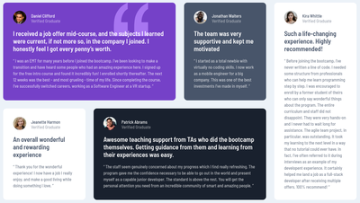

# Frontend Mentor - Testimonials grid section solution

This is a solution to the [Testimonials grid section challenge on Frontend Mentor](https://www.frontendmentor.io/challenges/testimonials-grid-section-Nnw6J7Un7). Frontend Mentor challenges help you improve your coding skills by building realistic projects. 

## Table of contents

- [Overview](#overview)
  - [The challenge](#the-challenge)
  - [Screenshot](#screenshot)
  - [Links](#links)
- [My process](#my-process)
  - [Built with](#built-with)
  - [What I learned](#what-i-learned)
  - [Useful resources](#useful-resources)
- [Author](#author)

## Overview

### The challenge

Users should be able to:

- View the optimal layout for the site depending on their device's screen size

### Screenshot




### Links

- Solution URL: [https://www.frontendmentor.io/solutions/css-grid-with-span-syntax-and-custom-properties-N7ZniQim5](https://www.frontendmentor.io/solutions/css-grid-with-span-syntax-and-custom-properties-N7ZniQim5)
- Live Site URL: [https://loganwoolf.github.io/FM-testimonials-grid/](https://loganwoolf.github.io/FM-testimonials-grid/)

## My process

### Built with

- Semantic HTML5 markup
- CSS custom properties
- CSS utility classes
- CSS Grid
- CSS Flexbox
- Mobile-first workflow

### What I learned

- Refactored utility functions to color the cards instead of targeting each one separately with child selectors. This saved a lot of repitition.
```html
<div id="card-1" class="card bg-purple bg-quote">
```
```css
.bg-quote {
	background: url(../images/bg-pattern-quotation.svg) top right no-repeat;
	background-position: 90% 0%; /*move image left from top left*/
}
.bg-purple {
	background-color: var(--bg-1);
	color: var(--text-1);
}
```
- Set a fixed height for a flex container to allow avatar to appear next to name and handle. I believe this could be achieved more gracefully with grid span, but it worked out.
```css
.user {
  display: flex;
  flex-direction: column;
  flex-wrap: wrap;
  height: 41px;
  align-content: flex-start;
}
.user > img {
  max-width: 40px;
  height: auto;
  border-radius: 50%;
}
```
- Used span syntax to move items around on the grid template. I've since learned you can use span all on its own, along with 
```css
grid-auto-flow: row dense; /*was not used in this project*/
```
```css
#card-4 {
		grid-column: 2 / span 2;
		grid-row: 2 / span 1;
	}
	#card-5 {
		grid-column: 4 / span 1;
		grid-row: 1 / span 2;
	}
```

### Useful resources

- [GRID: Cheatsheet (malven.co)](https://grid.malven.co/) - This is a very useful cheatsheet for CSS Grid.
- [Grid Practice, a Pen by Logan Woolf](https://codepen.io/loganwoolf/pen/abJgQNw) - I created this little practice pen for placing items with different utility classes on a grid after coding this project.

## Author

- Website - [Logan Woolf](https://loganwoolf.github.io/)
- Frontend Mentor - [@loganwoolf](https://www.frontendmentor.io/profile/loganwoolf)
- Twitter - [@logan__woolf](https://www.twitter.com/logan__woolf
